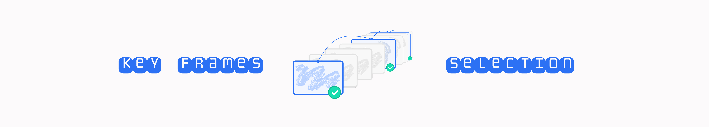

# Key Frames Selection

A feature-tracking-based pipeline for **automatic key frame extraction** from long videos.  
It combines **Shi–Tomasi corner detection**, **spatial patching with intersections**, and **Lucas–Kanade sparse optical flow** tracking to identify frames that best represent temporal changes.

---

## Overview

This project detects **key moments** in a video by analyzing the persistence of visual features through time.

1. **Feature Detection — Shi–Tomasi Algorithm**
   - Detects strong corner features for each patch.
   - Based on the minimum eigenvalue of the gradient covariance matrix:
     $R = \min(\lambda_1, \lambda_2)$ where $(\lambda_1, \lambda_2)$ are eigenvalues of the image gradient matrix.

2. **Patch Division & Intersection**
   - Each frame is divided into spatial patches (e.g. $3×3$ or $4×4$ grid).
   - Features are tracked **independently** for each patch.
   - Patches are **overlapping** to ensure smooth continuity at boundaries.

3. **Feature Tracking — Lucas–Kanade Optical Flow**
   - Tracks feature movement between consecutive frames using:
     $I(x + u, \, y + v, \, t + 1) \approx I(x, \, y, \, t)$, solving for optical flow vector $(u, v)$ via least squares.

4. **Key Frame Selection**
   - As frames progress, some features are lost (occlusion, motion blur, etc.).
   - A frame is marked as **key** when **multiple patches simultaneously** fall below a predefined feature-retention threshold:
     $\frac{N_{\text{tracked}}}{N_{\text{initial}}} < \tau$ across $\ge k$ patches.


## Key Frames Selection — `config.json` reference

### `paths`

* `input_video`: path to source video used for frame extraction.
* `frames_dir`: directory with extracted frames (read by the pipeline).
* `output_dir`: directory for reports/outputs.
* `keyframes_dir`: directory where selected keyframes are copied.

### `preprocess`

* `resize.width` (int|null): target width; `null` keeps original.
* `resize.height` (int|null): target height; `null` keeps original.
* `keep_aspect` (bool): if true and both sides set — scale to fit (no padding).
* `interpolation` (`nearest`/`linear`/`cubic`/`area`/`lanczos`): resize kernel.

### `patching`

* `nw` (int): number of patches along width.
* `nh` (int): number of patches along height.
* `centroidal` (bool): add overlapping “center” patches to reduce boundary artifacts.

### `shi_tomasi`

* `CORNERS_LIMIT_PER_IMAGE` (int): target total corners per frame after merge.
* `dedup_radius` (number): radius for greedy corner deduplication (px).
* `qualityLevel` (number): OpenCV quality threshold (higher → fewer points).
* `minDistance` (number): min distance between detected corners (px).
* `max_corners_patch` (int): per-patch candidate cap before merging.
* `useHarrisDetector` (bool): use Harris instead of Shi–Tomasi.
* `blockSize` (int): covariance sum window (px).
* `gradientSize` (int): Sobel aperture size (odd ≥ 3).
* `k` (number): Harris free parameter (ignored for Shi–Tomasi).

### `lucas_kanade`

* `winSize` ([int,int]): LK window size (px).
* `maxLevel` (int): pyramid levels.
* `criteria` ([int,int,number]): termination criteria tuple `(type, max_iter, eps)`.
* `max_error` (number): discard tracks with LK error above this.

### `selection`

* `retention_tau` (number): a patch “drops” if retained fraction < τ.
* `min_patches_k` (int): mark keyframe if ≥k patches drop simultaneously.
* `copy_keyframes` (bool): copy keyframe images to `keyframes_dir`.

### `visualization`

* `enabled` (bool): write one painted image per input frame.
* `dir` (str): output folder for painted frames.
* `tracked_color` (hex): color for **tracked** corners.
* `new_color` (hex): color for **new** corners spawned this frame.
* `patch_drop_color` (hex): overlay color for dropping patches.
* `patch_drop_alpha` (number): overlay opacity for dropping patches.
* `point_radius` (int): corner circle radius (px).
* `point_thickness` (int): circle thickness (`-1` = filled).


## Basic commands (utilities)

**Video → Frames**

To convert a video (in `.mp4`, `.mov`, etc.) use the following utility:
```bash
python src/video_to_frames.py <full-path-to-video> <output-frames-directory> --max-fps 4 --ext png --overwrite false
```

**Frames → video**

```bash
python src/frames_to_video.py <frames-directory> <full-video-output-path> --fps 24 --ext png --overwrite
```


## Licence

MIT